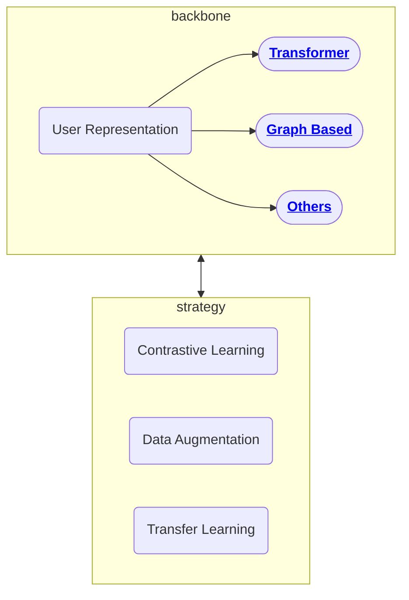

# User Representation

## Discussion

#### Difficulties in Work

- lack of training data (usually user tag data are from surveys, we can't send survey to all user, only small portion of user may get this survey, little of them may finish it)
   - contrastive learning
      -  positive samples augmentation
      -  hard negtive

- label noise in the training data
- how to apply a generic representation in different  downstream task
  - pretraining and fine tuning
      - gap beteewn pretarining and fine tuning
      - sequence length
- performance of large-scale graph computations

#### Potential Research Area

- Applications:

  - Recommendation
  - User Tagging
  - Topic Mining
  - relation mining

- Problem to Solve:

  - data augmentation: with user-item-user relationship graph, help us get more label

  - data denoising
  - graph related: interests(topic) - item linking
  - user-user / user-item graph

## Roadmaps

## Datasets

| Dataset               | Address                                                      | Size |
| --------------------- | ------------------------------------------------------------ | ---- |
| Tencent TL dataset    | https://drive.google.com/file/d/1imhHUsivh6oMEtEW-RwVc4OsDqn-xOaP/view |      |
| MovieLens 25M Dataset | https://grouplens.org/datasets/movielens/25m/                | 25m  |
| Amazon                | https://nijianmo.github.io/amazon/index.html                 |      |
| Yelp                  | https://www.yelp.com/dataset                                 |      |
| MIND                  | https://msnews.github.io/                                    |      |
| AliPay                | https://tianchi.aliyun.com/dataset/dataDetail?dataId=53      |      |
| Tmall                 | https://tianchi.aliyun.com/dataset/dataDetail?dataId=42      |      |
| Alimama               | https://tianchi.aliyun.com/dataset/dataDetail?dataId=56      |      |

